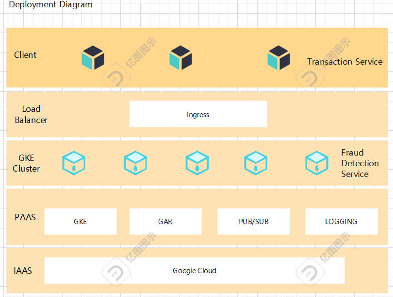

# Fraud Detect Service

## Project Overview

This project aims to build a foundational financial transaction fraud detection system. Through real-time analysis, rule-based detection, and high-availability deployment, the system identifies potential fraudulent activities to enhance financial security. Key features include performance optimization and comprehensive testing to ensure stability in large-scale transactional environments.

## Core Features

- **Real-Time Transaction Analysis**: Monitors and analyzes each transaction in real time to detect anomalies (e.g., frequent transactions, abnormal amounts) before fraud occurs.
- **Rule-Based Detection Engine**: Screens transactions using predefined rules which using the chain of responsibility design pattern to implement  (e.g., amount thresholds, suspicious accounts, composite rules) for rapid fraud identification.
- **Fraud-Detection-Message**: publish immediate message and logs upon detecting fraudulent activity, enabling quick risk management intervention.

## High Availability & Resilience

- **Kubernetes Cluster Deployment**: Ensures automated management, scaling, and recovery via containerization.
- **Horizontal Pod Autoscaler (HPA)**: Dynamically adjusts service replicas based on real-time load.
- **Message Queuing (Google cloud Pub/Sub)**: Buffers high-concurrency traffic for asynchronous processing.

## Performance Optimization

- **Low-Latency Processing**: Achieves millisecond-level transaction processing.
- **Centralized Logging (Google cloud logging)**: Enables real-time monitoring and troubleshooting.

## Testing Strategy

- **Unit & Integration Tests**: Validate module functionality using JUnit and Spring Boot Test.
- **Stress Testing**: Simulates high concurrency and system failures to verify stability.
- **Resilience Testing**: Tests pod/node failure recovery to ensure 9-second failover.

---

## Deployment Diagram

## Transaction Workflow

1. **Request Reception**: Transactions are received via `http://localhost:8080/fraud/detect`.
2. **Logging (Google cloud logging)**: Logs transaction metadata for auditing.
3. **Fraud Detection Module**: Applies rule-based checks to identify fraud patterns.
4. **Rule Engine**:
    - **Rule Matching**: Checks against amount thresholds, account history, country, IP etc.
    - **Fraud Detection Message**: Flags suspicious transactions and notifies stakeholders.
5. **Post-Processing**: Optional integration with audit teams or downstream services.

## Design Rationale

1. **Real-Time Efficiency**: Synchronous processing ensures low latency for critical fraud checks.
2. **Audit Compliance**: Full transaction traceability via GCP Stackdriver logs.
3. **Extensible Rule Engine**: Adapts to emerging fraud patterns with modular rules.
4. **Production Readiness**: Simplified demo architecture allows easy transition to async queuing (e.g., Pub/Sub).